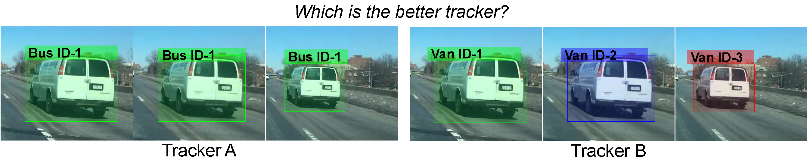
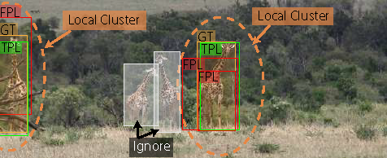

# Track Every Thing Accuracy
[Track Every Thing in the Wild](https://arxiv.org/abs/2207.12978) [ECCV 2022].

This is the official implementation of TETA metric describe in the paper. This repo is an updated version of the original [TET repo](https://github.com/SysCV/tet) for TETA metric.




## Introduction

TETA is a new metric for tracking evaluation that breaks tracking measurement into three sub-factors: localization, association, and classification, allowing comprehensive benchmarking of tracking performance even under inaccurate classification. 
TETA also deals with the challenging incomplete annotation problem in large-scale tracking datasets.
Instead of using the predicted class labels to group per-class tracking results, we use location with the help of local cluster evaluation.
We treat each ground truth bounding box of the target class as the anchor of each cluster and group prediction results inside each cluster to evaluate the localization and association performance.
Our local clusters enable us to evaluate tracks even when the class prediction is wrong.



## Why you should use TETA metric

TETA is designed to evaluate multiple object tracking (MOT) and segmentation (MOTS) in large-scale **multiple classes** and  **open-vocabulary** scenarios.
It has been widely used for evaluate trackers performance on BDD100K and TAO datasets.
Some key features of TETA are:
- **Disentangle classification from tracking**: TETA disentangles classification from tracking, allowing comprehensive benchmarking of tracking performance. Don't worry if your tracker is not the strongest in classification. TETA can still gives you credits for good localization and association.
- **Comprehensive evaluation**: TETA consists of three parts: a localization score, an association score, and a classification score, which enable us to evaluate the different aspects of each tracker properly.
- **Dealing with incomplete annotations**: TETA evaluates trackers based on a novel local cluster design. TETA deals with the challenging incomplete annotation problem. You can even evaluate your MOT tracker on a single object tracking dataset!
- **Easy to use**: TETA is easy to use and support COCO-VID style format for most tracking datasets and Scalabel format for BDD100K.  You just need to prepare your results json in the right format and run the evaluation script.
- **Support evaluation with both mask and box format**: TETA can evaluate tracking results in both mask and box format. The key differences are whether we use mask IoU or box IoU for localization evaluation.

## Install
Install the TETA environment using pip.
```angular2html
pip install -r requirements.txt
```
Go to the root of the teta folder and quick install by
```
pip install -e .
```
## Support data format

### COCO-VID format
Result format follows COCO-VID format. We describe the format in detail [here](./docs/TAO-format.txt)

### Scalabel format
For evaluate MOT and MOTS on BDD100K, we support Scalabel format. We describe the format in detail [here](https://github.com/scalabel/scalabel/blob/master/doc/src/format.rst)

## Evaluate on TAO TETA benchmark

Overall you can run following command to evaluate your tracker on TAO TETA benchmark, given the ground truth json file and the prediction json file using [COCO-VID format](./docs/TAO-format.txt).
```angular2html
python scripts/run_tao.py --METRICS TETA --TRACKERS_TO_EVAL $NAME_OF_YOUR_MODEL$ --GT_FOLDER ${GT_JSON_PATH}.json --TRACKER_SUB_FOLDER ${RESULT_JSON_PATH}.json   
```
### TAO TETA v0.5 
Please note, TAO benchmark initially aligns its class names with LVISv0.5 which has 1230 classes. For example, the initial TETA benchmark on [TET paper](https://github.com/SysCV/tet) is using v0.5 class names.

**Example Run:**

* Download GT: If your model use LVIS v0.5 class names, you can evaluate your model on TAO TETA v0.5 benchmark by using the corresponding ground truth json file.  We provide TAO Val Ground Truth json file in v0.5 format [tao_val_lvis_v05_classes.json](https://huggingface.co/dereksiyuanli/masa/resolve/main/tao_val_lvis_v05_classes.json)

* Download Example Pred: You can download an example prediction file from the [TETer-swinL model](https://github.com/SysCV/tet)'s result json file: [teter-swinL-tao-val.json](https://drive.google.com/file/d/1ZXXV-hQOxC-luSQcH3ph1k1ETUe6rYKV/view).

* Run Command, assume you put your downloaded files in the ```./jsons/``` under the root folder:
```angular2html
python scripts/run_tao.py --METRICS TETA --TRACKERS_TO_EVAL my_tracker --GT_FOLDER ./jsons/tao_val_lvis_v05_classes.json --TRACKER_SUB_FOLDER ./jsons/teter-swinL-tao-val.json
```

### TAO TETA v1.0
Since LVIS update the class names to v1.0, we also provide TAO Val Ground Truth json file in v1.0 format [tao_val_lvis_v1_classes.json](https://huggingface.co/dereksiyuanli/masa/resolve/main/tao_val_lvis_v1_classes.json)
The conversion script is provided in the [scripts](https://github.com/SysCV/ovtrack/blob/main/tools/convert_datasets/create_tao_v1.py) if you want to convert the v0.5 class names to v1.0 class names by yourself.

**Example Run:**

* Download GT: [tao_val_lvis_v1_classes.json](https://huggingface.co/dereksiyuanli/masa/resolve/main/tao_val_lvis_v1_classes.json)
* Download Example Pred: You can download an example prediction file from [MASA-GroundingDINO](https://github.com/siyuanliii/masa/blob/main/docs/model_zoo.md)'s results json file tested on TAO val:  [masa-gdino-detic-dets-tao-val-preds.json](https://drive.google.com/file/d/195wFJY4uxBGZKtZGb3DyvB6EdDED4Rx2/view?usp=sharing).

* Run Command, assume you put your downloaded files in the ```./jsons/``` under the root folder:
```angular2html
python scripts/run_tao.py --METRICS TETA --TRACKERS_TO_EVAL my_tracker --GT_FOLDER ./jsons/tao_val_lvis_v1_classes.json --TRACKER_SUB_FOLDER ./jsons/masa-gdino-detic-dets-tao-val-preds.json
```

## Evaluate on Open-Vocabulary MOT benchmark

Open-Vocabulary MOT benchmark is first introduced by [OVTrack](https://openaccess.thecvf.com/content/CVPR2023/papers/Li_OVTrack_Open-Vocabulary_Multiple_Object_Tracking_CVPR_2023_paper.pdf). Here we provide the evaluation script for Open-Vocabulary MOT benchmark.
Open-Vocabulary MOT benchmark uses TAO dataset as the evaluation dataset and use LVIS v1.0 class names.

Overall, you can use follow command to evaluate your trackers on Open-Vocabulary MOT benchmark.
```angular2html
python scripts/run_ovmot.py --METRICS TETA --TRACKERS_TO_EVAL $NAME_OF_YOUR_MODEL$ --GT_FOLDER ${GT_JSON_PATH}.json --TRACKER_SUB_FOLDER ${RESULT_JSON_PATH}.json   
```

### Run on Open-Vocabulary MOT validation set
* Download GT: [tao_val_lvis_v1_classes.json](https://huggingface.co/dereksiyuanli/masa/resolve/main/tao_val_lvis_v1_classes.json)
* Download Example Pred: You can download an example prediction file from [MASA-GroundingDINO](https://github.com/siyuanliii/masa?tab=readme-ov-file)'s results json file tested on Open-Vocabulary MOT:  [masa-gdino-detic-dets-tao-val-preds.json](https://drive.google.com/file/d/195wFJY4uxBGZKtZGb3DyvB6EdDED4Rx2/view?usp=sharing).
* Run Command, assume you put your downloaded files in the ```./jsons/``` under the root folder:
```angular2html
python scripts/run_ovmot.py --METRICS TETA --TRACKERS_TO_EVAL my_tracker --GT_FOLDER ./jsons/tao_val_lvis_v1_classes.json --TRACKER_SUB_FOLDER ./jsons/masa-gdino-detic-dets-tao-val-preds.json  
```

### Run on Open-Vocabulary MOT test set
* Download GT: [tao_test_lvis_v1_classes.json](https://drive.google.com/file/d/19LxOj0w3lNyw4IGeMpwFd5OxC4PzFyrv/view?usp=sharing).
* 
Then you can evaluate your tracker on Open-Vocabulary MOT test set by using the corresponding ground truth json file like above.


## Evaluate on BDD100K MOT TETA benchmark
Run on BDD100K MOT val dataset. 

* Download GT:  Please first download the annotations from the [official website](https://doc.bdd100k.com/download.html). On the download page, the required data and annotations are `mot` set annotations: `MOT 2020 Labels`.
* Download Example Pred: You can download an example prediction file from the [MASA-SAM-ViT-B](https://github.com/siyuanliii/masa/blob/main/docs/model_zoo.md)'s results json file tested on BDD100K MOT val:  [masa_sam_vitb_bdd_mot_val.json](https://drive.google.com/file/d/19diA2Zij-lbDUP0CzJa36nYWKrGy_4dn/view?usp=sharing)
* Run Command, assume you put your downloaded the pred in the ```./jsons/``` under the root folder and the GT in the ```./data/bdd/annotations/scalabel_gt/box_track_20/val/```:
* 
```angular2html
python scripts/run_bdd.py --scalabel_gt data/bdd/annotations/scalabel_gt/box_track_20/val/ --resfile_path ./jsons/masa_sam_vitb_bdd_mot_val.json --metrics TETA HOTA CLEAR 
```


## Evaluate on BDD100K MOTS TETA benchmark
Run on BDD100K MOTS val dataset. 

* Download GT:  Please first download the annotations from the [official website](https://doc.bdd100k.com/download.html). On the download page, the required data and annotations are `mots` set annotations: `MOTS 2020 Labels`.
* Download Example Pred: You can download an example prediction file from the [MASA-SAM-ViT-B](https://github.com/siyuanliii/masa/blob/main/docs/model_zoo.md)'s results json file tested on BDD100K MOT val:  [masa_sam_vitb_bdd_mots_val.json](https://drive.google.com/file/d/19pAS0Nt74hptFnFgRBL_wMs3aZcRR6UV/view?usp=sharing)
* Run Command, assume you put your downloaded the pred in the ```./jsons/``` under the root folder and the GT in the ```./data/bdd/annotations/scalabel_gt/seg_track_20/val/```:
```angular2html
python scripts/run_bdd.py --scalabel_gt data/bdd/annotations/scalabel_gt/seg_track_20/val/ --resfile_path ./jsons/masa_sam_vitb_bdd_mots_val.json --metrics TETA HOTA CLEAR --with_mask
```


## Citation

```
@InProceedings{trackeverything,
  title = {Tracking Every Thing in the Wild},
  author = {Li, Siyuan and Danelljan, Martin and Ding, Henghui and Huang, Thomas E. and Yu, Fisher},
  booktitle = {Proceedings of the European Conference on Computer Vision (ECCV)},
  month = {Oct},
  year = {2022}
}
```